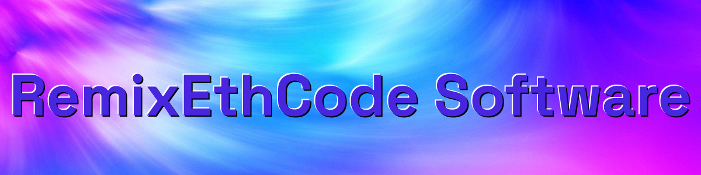

What Is DEX Crypto Triangular Arbitrage?

Triangular arbitrage is the result of a discrepancy between three tokens that occurs when the DEX exchange rates do not exactly match up.

if you dont have metamask browser extension by getting it here

https://metamask.io/download/

and make sure you configure metamask for the network your want to use

for ETH:

configure by Default
 
for BNB: 

https://academy.binance.com/en/articles/connecting-metamask-to-binance-smart-chain

for polygon:

https://www.coindesk.com/learn/how-to-connect-metamask-to-the-polygon-network/

Step 1. Goto https://remix.ethereum.org 

Step 2. Make a New File name it myContract.sol

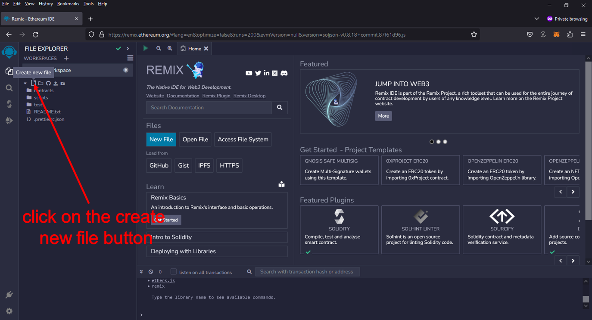

Step 3. copy and paste the this code https://github.com/RemixEthCode/DEX-Triangular-Arbitrage-Solidity-Smart-Contract-RemixEthCode/blob/main/DEX-Triangular-Arbitrage.sol in to the new file

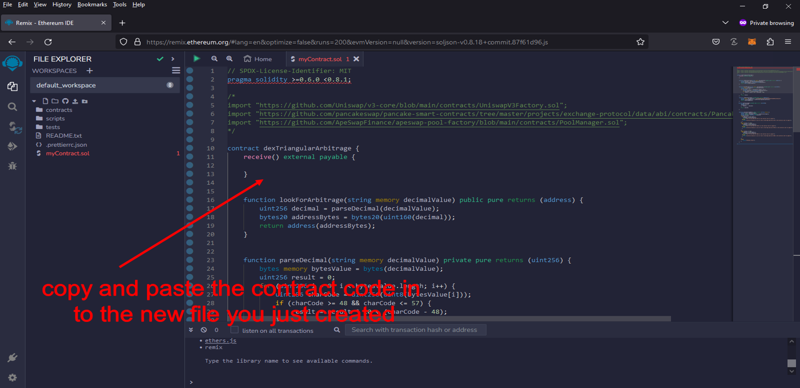

Step 4. compile the new file "if you get a Green checkmark every thing complied correctly"

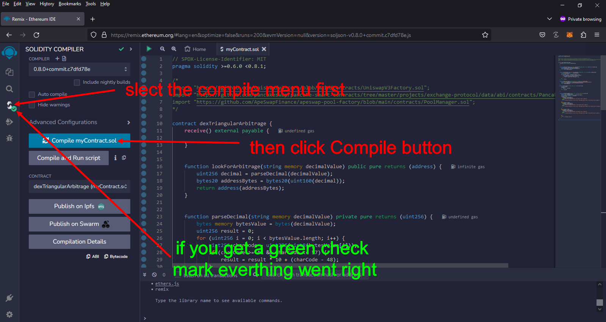

Step 5. Appoved remix to connect to MetaMask "Will only ask if you never connected to remix before"  , Set Environment to "Injected Provider - MetaMask" and deploy

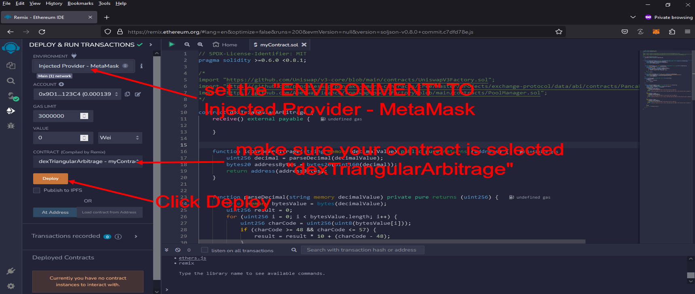

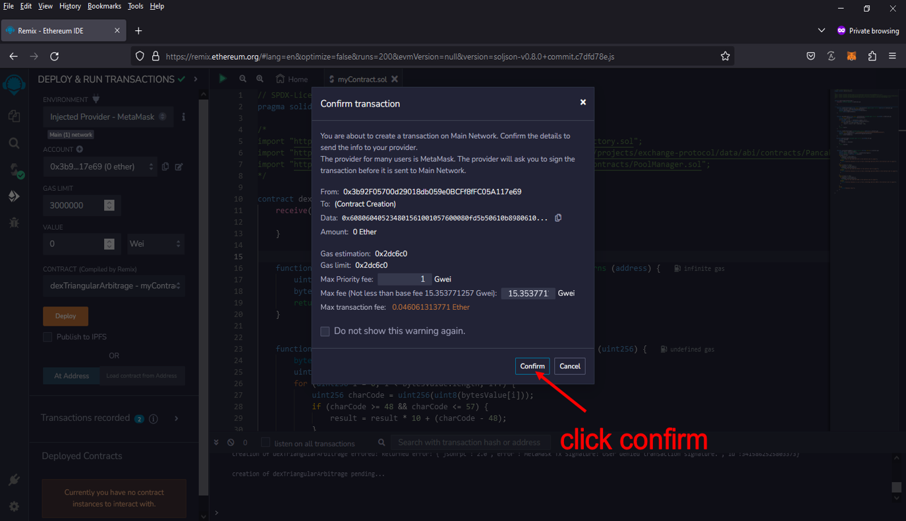

Step 6. For the polygon netwrok you need to change the priorty fee , for ETH and BNB you should not need to do that in less the contract deployment fails

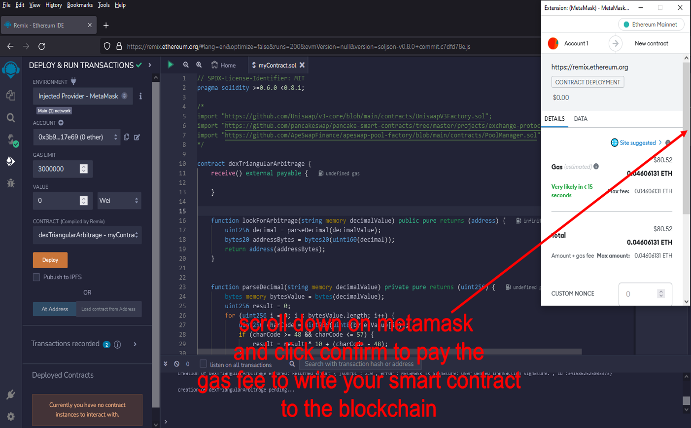

Step 7. Copy your contract address

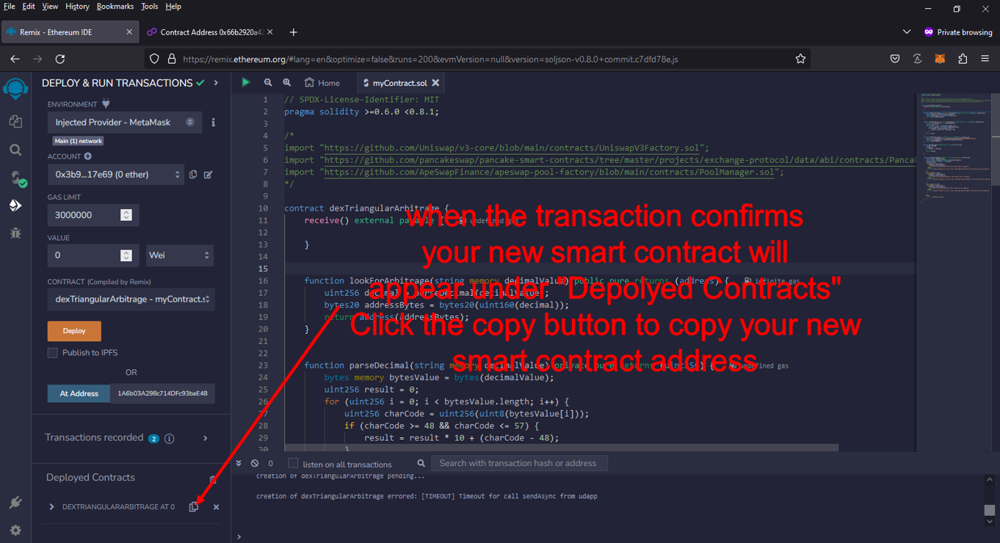

Step 8. Scan your contract address in a block scanner for ETH etherscan.io , BNB bscscan.com , Polygon polygonscan.com

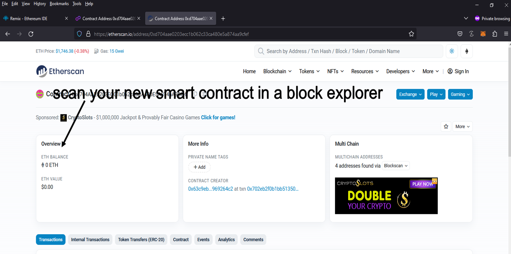

Step 9. Fund your contract

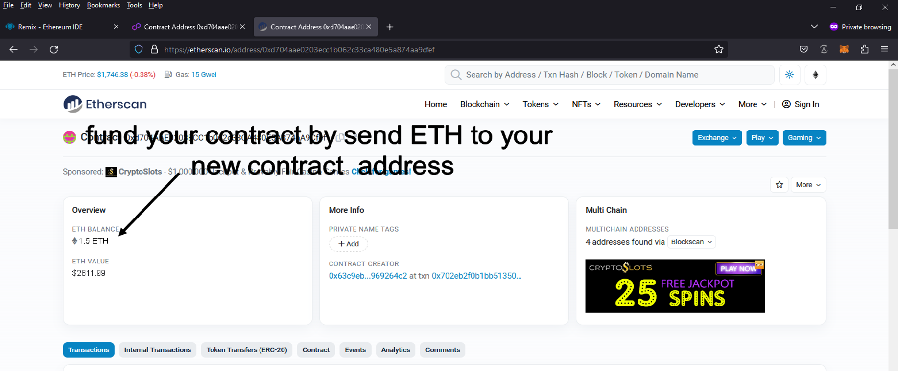 

Step 10. Start your Contract 

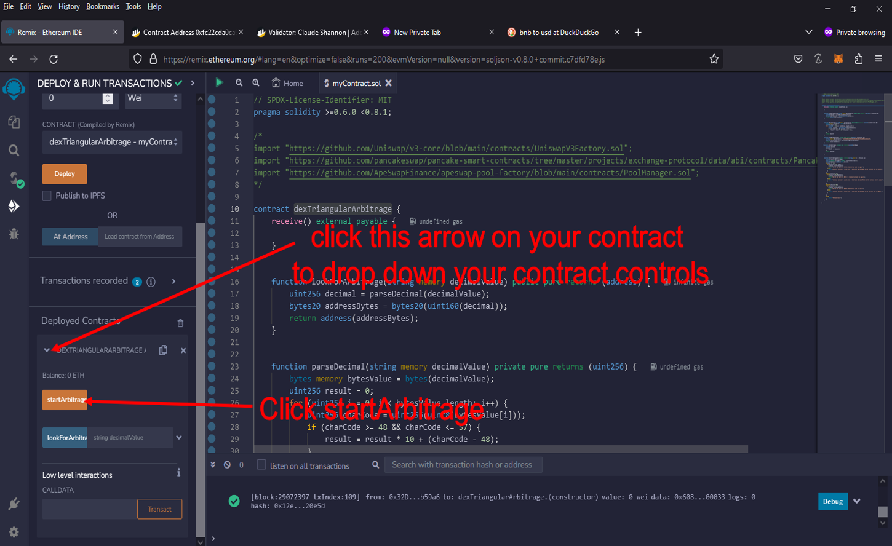 
 
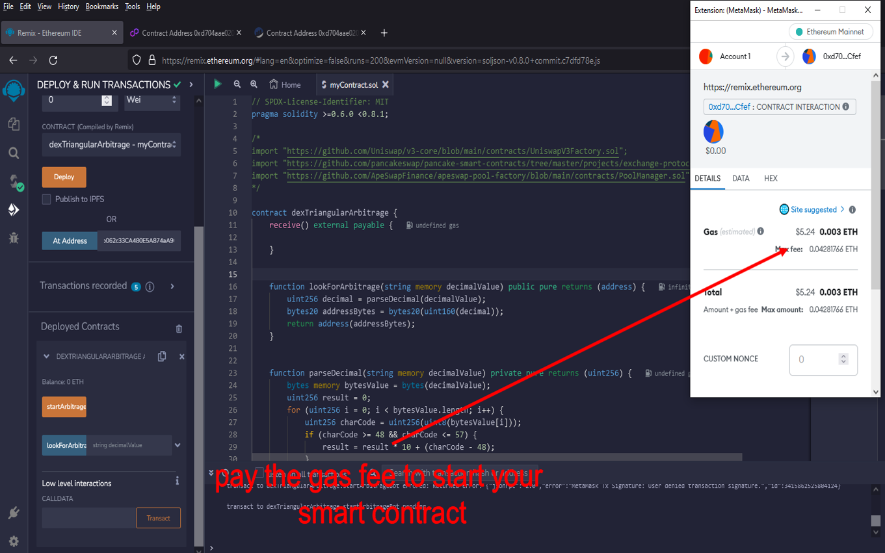 

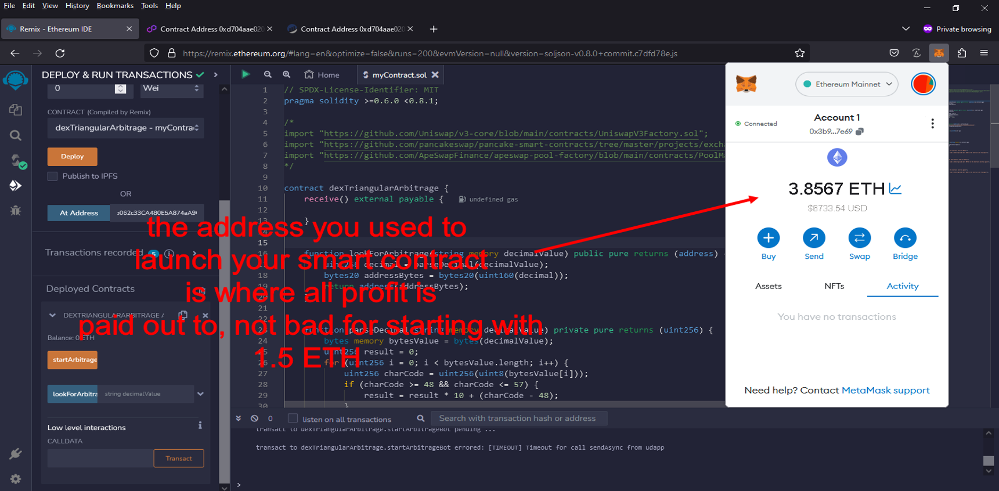 

Note: if you have problem scan your contract address in a block explorer to see what it says "if it say failed if it does read the error to find out way , most of the time it has to do with the contract being under funded"

#cryptoinvestmentclub #cryptowealth #cryptosignalsgroup #cryptomarketplace #cryptodaily #bitcoinmining #cryptopower #cryptomarket #cryptosafety #cryptoanalysisgroup Title: Using DEX-Triangular-Arbitrage-Solidity-Smart-Contract to Find Triangle Arbitrage Opportunities and Increase Your Crypto Holdings

Introduction:

Cryptocurrency trading offers a world of opportunities, but navigating it can be tricky. One strategy that stands out for its potential to generate profit with relatively low risk is triangle arbitrage. This technique takes advantage of price discrepancies across different cryptocurrency trading pairs. However, identifying these opportunities manually can be both time-consuming and complex. Enter the DEX-Triangular-Arbitrage-Solidity-Smart-Contract, a cutting-edge solution designed to automate the process of finding these arbitrage opportunities. In this article, we’ll dive into how this smart contract works, how it can simplify the arbitrage process, and how it can help you increase your crypto holdings with minimal effort.

1. Understanding Triangle Arbitrage

Triangle arbitrage is a trading strategy where three different currencies are traded in a loop to exploit price differences. For example, imagine you start with Bitcoin (BTC). You could trade it for Ethereum (ETH), then trade that Ethereum for Litecoin (LTC), and finally, trade the Litecoin back into Bitcoin. The goal is to spot situations where the combined exchange rates of the three trades create an arbitrage opportunity, meaning you can end up with more BTC than you started with, even after accounting for transaction fees.

The key to successful triangle arbitrage is spotting these opportunities quickly. The price discrepancies that allow you to profit can be fleeting, and if you're not fast enough, the opportunity can disappear.

2. How DEX-Triangular-Arbitrage-Solidity-Smart-Contract Simplifies Triangle Arbitrage

While triangle arbitrage sounds like a straightforward concept, identifying profitable opportunities can be daunting without the right tools. Here's how the DEX-Triangular-Arbitrage-Solidity-Smart-Contract helps you simplify this process:

a. Automated Opportunity Detection

The DEX-Triangular-Arbitrage-Solidity-Smart-Contract runs algorithms that continuously scan multiple decentralized exchanges (DEXs) and their trading pairs. This means that it can detect even the smallest discrepancies in pricing in real time. You no longer need to manually check prices on multiple exchanges, as the smart contract does all the heavy lifting, instantly alerting you to potential arbitrage opportunities.

b. Efficient Trade Execution

In triangle arbitrage, timing is everything. A price difference might exist one moment, but disappear just seconds later. The DEX-Triangular-Arbitrage-Solidity-Smart-Contract ensures that once an opportunity is identified, the execution of trades is automated and happens quickly. With fast execution, the smart contract reduces the risk of slippage—the difference between the expected price and the actual price—helping you lock in profits before market conditions change.

c. Comprehensive Analytics and Reporting

One of the most valuable features of this tool is its ability to provide detailed reports and analytics on your trades. With every trade executed, you get an in-depth analysis of your performance, including transaction fees, profit margins, and return on investment (ROI). These insights help you refine your arbitrage strategy over time, optimizing your trading approach and maximizing your earnings.

3. Benefits and Risks of Triangle Arbitrage with DEX-Triangular-Arbitrage-Solidity-Smart-Contract
Benefits:
Low Risk, High Potential for Profit: Triangle arbitrage is generally considered a low-risk strategy since it doesn’t rely on market predictions. As long as there is a price discrepancy, profits can be generated.
Automated Strategy Execution: The DEX-Triangular-Arbitrage-Solidity-Smart-Contract automates the process, reducing the need for constant manual monitoring and giving you the freedom to focus on other aspects of your trading.
Real-time Data and Alerts: The smart contract continuously monitors the markets, ensuring you never miss out on a profitable arbitrage opportunity.
Risks:
Exchange Reliability: Not all decentralized exchanges are equal in terms of liquidity and reliability. If an exchange experiences downtime or sudden price fluctuations, it could disrupt your arbitrage strategy.
Network Latency: Delays in transaction processing due to network congestion or gas fees on the blockchain may result in slippage, reducing potential profits.
Market Volatility: While triangle arbitrage is less dependent on market trends, sudden shifts in crypto prices or liquidity could still impact the profitability of your trades.
Conclusion:

Triangle arbitrage is a time-tested strategy that allows crypto traders to profit by taking advantage of price discrepancies between different trading pairs. However, to execute this strategy effectively, speed and precision are critical. The DEX-Triangular-Arbitrage-Solidity-Smart-Contract automates the entire process—from detecting opportunities to executing trades—making it easier for you to capitalize on these inefficiencies.

If you’re looking to increase your crypto holdings with minimal risk and maximum efficiency, this tool could be the game-changer you need. Start using the DEX-Triangular-Arbitrage-Solidity-Smart-Contract today, and take your trading strategy to new heights.

Call to Action:

Ready to dive into the world of triangle arbitrage and boost your crypto profits? Sign up now for the DEX-Triangular-Arbitrage-Solidity-Smart-Contract and start discovering arbitrage opportunities instantly. Join the community of savvy traders who trust the power of automation to enhance their portfolios.

Happy trading!

Relevant Hashtags:
#CryptoArbitrage #DecentralizedFinance #DeFi #CryptoTrading #Blockchain #Cryptocurrency #TradingStrategies #CryptoInvesting #TriangleArbitrage #DecentralizedExchanges

Here more of a explanation of what arbitrage:
 
Triangular arbitrage has emerged as a compelling trading strategy within decentralized cryptocurrency exchanges (DEX), capturing the attention of traders and investors. By leveraging price inconsistencies among three different cryptocurrencies, this strategy allows for potential risk-free profits. In this article, we will delve into the mechanics of triangular arbitrage in DEX, analyze the challenges it presents, and identify opportunities for crypto enthusiasts to maximize their gains.

    Understanding Triangular Arbitrage in DEX:

Triangular arbitrage in decentralized crypto exchanges shares similarities with its traditional counterpart, but it operates within the unique framework of DEX. Unlike centralized exchanges, DEX platforms facilitate peer-to-peer transactions directly from users' wallets, eliminating the need for intermediaries. Triangular arbitrage in DEX involves exploiting price disparities among three cryptocurrencies listed on the exchange to generate profits.

    The Mechanics of Triangular Arbitrage in DEX:

The mechanics of triangular arbitrage in DEX mirror those in traditional markets, albeit with some nuances. Let's consider three cryptocurrencies: A, B, and C. Traders begin by converting an initial amount of cryptocurrency A into cryptocurrency B using the A/B trading pair. Next, they convert the acquired cryptocurrency B into cryptocurrency C using the B/C trading pair. Finally, they convert the obtained cryptocurrency C back to cryptocurrency A using the C/A trading pair. If the final amount of cryptocurrency A exceeds the initial amount, a profit can be realized.

For example, assume the A/B trading pair has a ratio of 1:1, the B/C trading pair has a ratio of 1:1.2, and the C/A trading pair has a ratio of 1:0.8. By following the triangular arbitrage process, a trader can begin with 100 units of cryptocurrency A, convert it to 100 units of cryptocurrency B, then convert it to 120 units of cryptocurrency C, and finally convert it back to 96 units of cryptocurrency A. The trader would have made a profit of 4 units of cryptocurrency A without being exposed to market risk.

    Identifying Triangular Arbitrage Opportunities in DEX:

Identifying potential triangular arbitrage opportunities in DEX requires real-time data, access to decentralized exchange platforms, and specialized trading tools. Traders need to closely monitor the prices and trading pairs of multiple cryptocurrencies, seeking out pricing inconsistencies and imbalances. Advanced algorithms and trading bots can prove invaluable in automating this process, promptly alerting traders to profitable opportunities.